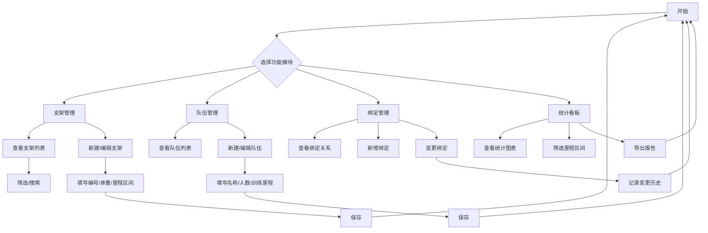

# 皮划艇运动基地岸边停靠架训练里程区间分组统计系统

## 1. Product Overview

皮划艇训练基地管理岸边停靠支架、固定托架的专业系统，核心功能为支架绑定训练队伍与常规训练里程区间，按里程维度自动统计配套支架数量。系统支持训练计划调整时变更支架绑定关系，并提供训练里程区间分组统计看板。

- 解决皮划艇基地支架资源管理混乱问题，实现按训练里程区间自动统计配套支架
- 目标用户：皮划艇训练基地管理员、教练团队
- 市场价值：提升训练基地资源利用率，优化训练计划安排，实现数据化管理

## 2. Core Features

### 2.1 User Roles

| Role | Registration Method | Core Permissions |
|------|---------------------|------------------|
| 管理员 | 系统后台配置 | 完整CRUD权限，包括支架管理、队伍管理、统计查看 |
| 教练 | 系统后台配置 | 查看统计看板、调整训练计划绑定关系 |

### 2.2 Feature Module

1. **支架管理页面**：支架基础信息建档、编辑、删除
2. **队伍管理页面**：训练队伍信息管理、训练里程绑定登记
3. **绑定管理页面**：支架与队伍绑定关系管理、变更记录查看
4. **统计看板页面**：各训练里程区间配套支架自动汇总统计可视化

### 2.3 Page Details

| Page Name | Module Name | Feature description |
|-----------|-------------|---------------------|
| 支架管理 | 支架列表 | 展示所有岸边停靠支架信息，支持筛选、分页 |
| 支架管理 | 支架表单 | 新建/编辑支架：编号、承重、适配训练里程区间（短/中/长距离） |
| 队伍管理 | 队伍列表 | 展示所有皮划艇训练队伍信息 |
| 队伍管理 | 队伍表单 | 新建/编辑队伍：名称、人数、常规训练里程区间 |
| 绑定管理 | 绑定列表 | 展示支架与队伍的绑定关系，支持查看变更历史 |
| 绑定管理 | 绑定操作 | 新增绑定、变更绑定关系、留存变更记录 |
| 统计看板 | 统计图表 | ECharts可视化展示各里程区间支架数量统计 |
| 统计看板 | 区间筛选 | 筛选指定里程区间查看配套支架清单 |

## 3. Core Process

### 3.1 支架建档流程

1. 管理员进入支架管理页面
2. 点击新建按钮，填写支架编号、承重、适配训练里程区间
3. 提交保存，系统自动生成支架记录
4. 支架可用于后续绑定训练队伍

### 3.2 队伍绑定流程

1. 管理员/教练进入绑定管理页面
2. 选择训练队伍和可用支架
3. 建立绑定关系，记录初始绑定时间
4. 训练计划调整时，变更绑定关系并留存变更记录

### 3.3 统计看板流程

1. 用户进入统计看板页面
2. 系统自动按训练里程区间（短/中/长距离）汇总统计配套支架数量
3. 用户可筛选指定里程区间查看详细支架清单
4. 支持图表导出功能

## 4. User Interface Design

### 4.1 Design Style

- **Primary Color**: #0077b6 (海洋蓝) - 体现水上运动主题
- **Secondary Color**: #00b4d8 (天空蓝) - 辅助色
- **Accent Color**: #48cae4 (浅蓝) - 强调色
- **Neutral Color**: #f0f9ff (浅灰蓝背景)

- **Button Style**: 圆角矩形，渐变色，hover效果明显
- **Font**: Inter (现代无衬线字体)，中文使用思源黑体
- **Layout Style**: 左侧导航，右侧内容区，卡片式布局
- **Icon Style**: Lucide Icons，简洁现代风格

### 4.2 Page Design Overview

| Page Name | Module Name | UI Elements |
|-----------|-------------|-------------|
| 首页/仪表盘 | 统计概览 | 卡片式统计数字、环形图、柱状图 |
| 支架管理 | 支架列表 | 表格展示、筛选栏、操作按钮组 |
| 支架管理 | 支架表单 | 表单输入、下拉选择、文件上传 |
| 队伍管理 | 队伍列表 | 卡片网格布局、搜索框 |
| 绑定管理 | 绑定列表 | 时间线展示变更记录、状态标签 |
| 统计看板 | 统计图表 | ECharts柱状图、饼图、筛选器 |

### 4.3 Responsiveness

- **Desktop**: 完整功能展示，左侧导航栏固定
- **Tablet**: 导航栏收起为汉堡菜单，内容自适应
- **Mobile**: 单列布局，卡片堆叠展示

### 4.4 视觉元素建议

- 背景使用渐变蓝色彩，体现水上游乐主题
- 支架图标使用船桨/船形元素
- 统计图表使用蓝色系配色方案
- 添加波浪线条装饰元素