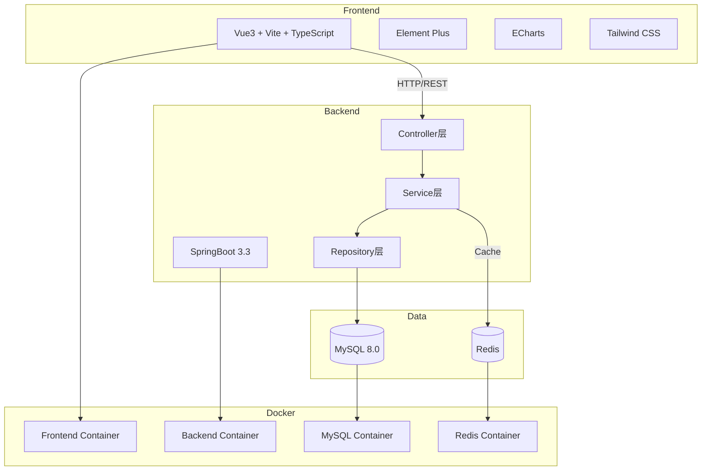
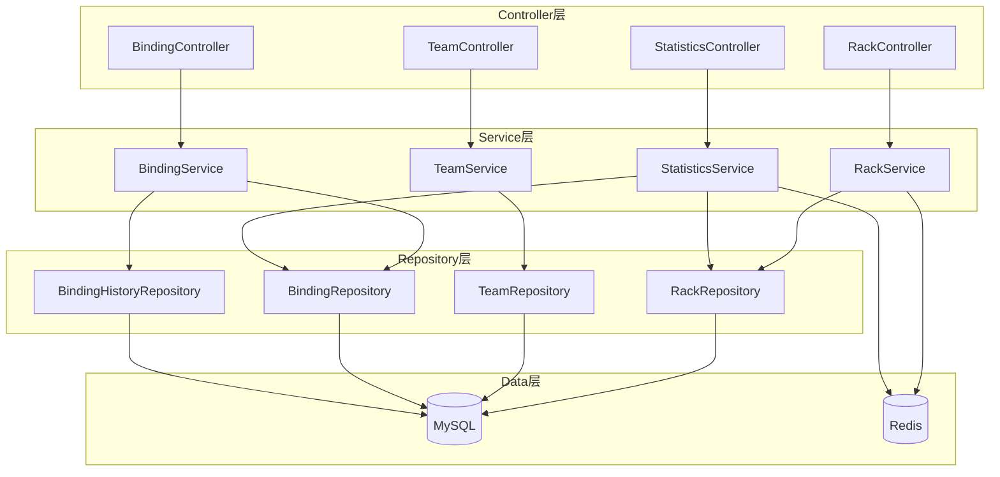
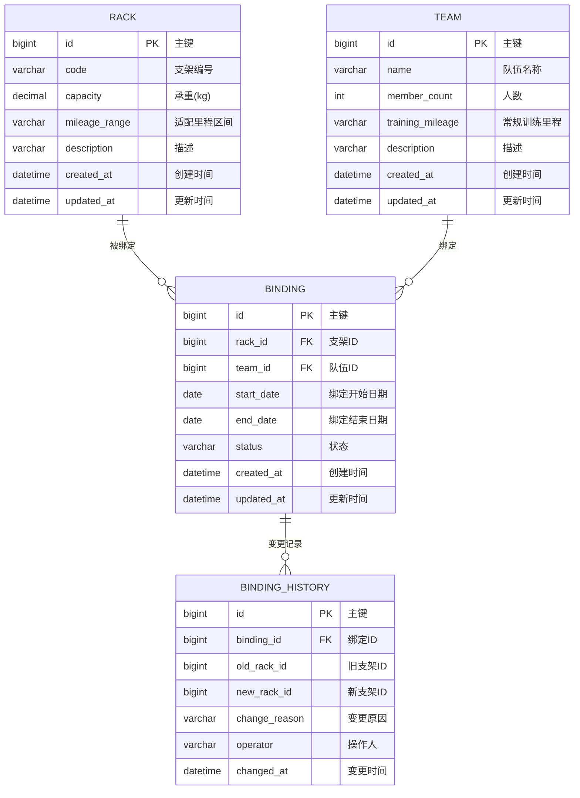

# 皮划艇运动基地岸边停靠架训练里程区间分组统计系统 - 技术架构文档

## 1. Architecture Design



## 2. Technology Description

- **Frontend**: Vue3@3.4 + TypeScript + Vite@5.2 + Element Plus@2.5 + ECharts@5.5 + Tailwind CSS@3.4
- **Backend**: SpringBoot@3.3 + JDK@17 + Spring Data JPA + Spring Cache (Redis)
- **Database**: MySQL@8.0
- **Cache**: Redis@7.2
- **Containerization**: Docker + Docker Compose
- **Build Tool**: Maven@3.9 (Backend) / npm@10 (Frontend)

## 3. Route Definitions

### 3.1 Frontend Routes

| Route | Purpose | Component |
|-------|---------|-----------|
| /dashboard | 首页仪表盘，统计概览 | Dashboard.vue |
| /racks | 支架管理页面 | RackManagement.vue |
| /teams | 队伍管理页面 | TeamManagement.vue |
| /bindings | 绑定关系管理页面 | BindingManagement.vue |
| /statistics | 统计看板页面 | StatisticsBoard.vue |

### 3.2 API Routes

| Route | Method | Purpose | Controller |
|-------|--------|---------|------------|
| /api/racks | GET | 查询支架列表 | RackController |
| /api/racks/{id} | GET | 查询单个支架 | RackController |
| /api/racks | POST | 新建支架 | RackController |
| /api/racks/{id} | PUT | 更新支架 | RackController |
| /api/racks/{id} | DELETE | 删除支架 | RackController |
| /api/teams | GET | 查询队伍列表 | TeamController |
| /api/teams/{id} | GET | 查询单个队伍 | TeamController |
| /api/teams | POST | 新建队伍 | TeamController |
| /api/teams/{id} | PUT | 更新队伍 | TeamController |
| /api/teams/{id} | DELETE | 删除队伍 | TeamController |
| /api/bindings | GET | 查询绑定列表 | BindingController |
| /api/bindings/{id} | GET | 查询单个绑定 | BindingController |
| /api/bindings | POST | 新建绑定 | BindingController |
| /api/bindings/{id} | PUT | 更新绑定 | BindingController |
| /api/bindings/{id} | DELETE | 删除绑定 | BindingController |
| /api/bindings/{id}/history | GET | 查询绑定变更历史 | BindingController |
| /api/statistics/mileage | GET | 获取里程区间统计 | StatisticsController |
| /api/statistics/mileage/{range} | GET | 获取指定里程区间支架清单 | StatisticsController |

## 4. API Definitions

### 4.1 支架接口

**GET /api/racks**
- Request: `{ "page": 0, "size": 10, "mileageRange": "SHORT/MEDIUM/LONG" }`
- Response: `{ "code": 200, "data": { "content": [...], "totalElements": 100 }, "message": "success" }`

**POST /api/racks**
- Request: `{ "code": "RACK001", "capacity": 200, "mileageRange": "MEDIUM", "description": "描述" }`
- Response: `{ "code": 200, "data": { "id": 1, "code": "RACK001", ... }, "message": "success" }`

### 4.2 队伍接口

**GET /api/teams**
- Request: `{ "page": 0, "size": 10 }`
- Response: `{ "code": 200, "data": { "content": [...], "totalElements": 50 }, "message": "success" }`

**POST /api/teams**
- Request: `{ "name": "第一训练队", "memberCount": 15, "trainingMileage": "MEDIUM" }`
- Response: `{ "code": 200, "data": { "id": 1, "name": "第一训练队", ... }, "message": "success" }`

### 4.3 绑定接口

**POST /api/bindings**
- Request: `{ "rackId": 1, "teamId": 1, "startDate": "2024-01-01" }`
- Response: `{ "code": 200, "data": { "id": 1, "rackId": 1, "teamId": 1, ... }, "message": "success" }`

**PUT /api/bindings/{id}**
- Request: `{ "rackId": 2, "teamId": 1, "changeReason": "训练计划调整" }`
- Response: `{ "code": 200, "data": { "id": 1, "rackId": 2, ... }, "message": "success" }`

### 4.4 统计接口

**GET /api/statistics/mileage**
- Response: `{ "code": 200, "data": { "SHORT": 10, "MEDIUM": 25, "LONG": 15 }, "message": "success" }`

**GET /api/statistics/mileage/{range}**
- Response: `{ "code": 200, "data": { "racks": [...], "total": 25 }, "message": "success" }`

## 5. Server Architecture Diagram



## 6. Data Model

### 6.1 Data Model Definition



### 6.2 Data Definition Language

```sql
CREATE TABLE IF NOT EXISTS rack (
    id BIGINT AUTO_INCREMENT PRIMARY KEY,
    code VARCHAR(50) NOT NULL UNIQUE COMMENT '支架编号',
    capacity DECIMAL(10,2) NOT NULL COMMENT '承重(kg)',
    mileage_range VARCHAR(20) NOT NULL COMMENT '适配里程区间: SHORT/MEDIUM/LONG',
    description VARCHAR(500) COMMENT '描述',
    created_at DATETIME DEFAULT CURRENT_TIMESTAMP COMMENT '创建时间',
    updated_at DATETIME DEFAULT CURRENT_TIMESTAMP ON UPDATE CURRENT_TIMESTAMP COMMENT '更新时间',
    INDEX idx_mileage_range (mileage_range)
) ENGINE=InnoDB DEFAULT CHARSET=utf8mb4 COMMENT='岸边停靠支架表';

CREATE TABLE IF NOT EXISTS team (
    id BIGINT AUTO_INCREMENT PRIMARY KEY,
    name VARCHAR(100) NOT NULL COMMENT '队伍名称',
    member_count INT DEFAULT 0 COMMENT '人数',
    training_mileage VARCHAR(20) NOT NULL COMMENT '常规训练里程: SHORT/MEDIUM/LONG',
    description VARCHAR(500) COMMENT '描述',
    created_at DATETIME DEFAULT CURRENT_TIMESTAMP COMMENT '创建时间',
    updated_at DATETIME DEFAULT CURRENT_TIMESTAMP ON UPDATE CURRENT_TIMESTAMP COMMENT '更新时间',
    INDEX idx_training_mileage (training_mileage)
) ENGINE=InnoDB DEFAULT CHARSET=utf8mb4 COMMENT='皮划艇训练队伍表';

CREATE TABLE IF NOT EXISTS binding (
    id BIGINT AUTO_INCREMENT PRIMARY KEY,
    rack_id BIGINT NOT NULL COMMENT '支架ID',
    team_id BIGINT NOT NULL COMMENT '队伍ID',
    start_date DATE NOT NULL COMMENT '绑定开始日期',
    end_date DATE COMMENT '绑定结束日期',
    status VARCHAR(20) DEFAULT 'ACTIVE' COMMENT '状态: ACTIVE/INACTIVE',
    created_at DATETIME DEFAULT CURRENT_TIMESTAMP COMMENT '创建时间',
    updated_at DATETIME DEFAULT CURRENT_TIMESTAMP ON UPDATE CURRENT_TIMESTAMP COMMENT '更新时间',
    FOREIGN KEY (rack_id) REFERENCES rack(id),
    FOREIGN KEY (team_id) REFERENCES team(id),
    INDEX idx_rack_id (rack_id),
    INDEX idx_team_id (team_id),
    INDEX idx_status (status)
) ENGINE=InnoDB DEFAULT CHARSET=utf8mb4 COMMENT='支架队伍绑定表';

CREATE TABLE IF NOT EXISTS binding_history (
    id BIGINT AUTO_INCREMENT PRIMARY KEY,
    binding_id BIGINT NOT NULL COMMENT '绑定ID',
    old_rack_id BIGINT COMMENT '旧支架ID',
    new_rack_id BIGINT NOT NULL COMMENT '新支架ID',
    change_reason VARCHAR(500) COMMENT '变更原因',
    operator VARCHAR(100) DEFAULT 'system' COMMENT '操作人',
    changed_at DATETIME DEFAULT CURRENT_TIMESTAMP COMMENT '变更时间',
    FOREIGN KEY (binding_id) REFERENCES binding(id),
    INDEX idx_binding_id (binding_id),
    INDEX idx_changed_at (changed_at)
) ENGINE=InnoDB DEFAULT CHARSET=utf8mb4 COMMENT='绑定变更历史表';
```

## 7. Redis缓存策略

### 7.1 缓存Key设计

| Key | Value | TTL | 说明 |
|-----|-------|-----|------|
| rack:spec:{id} | 支架规格模板JSON | 30分钟 | 缓存支架承重规格模板 |
| statistics:mileage | 里程统计结果JSON | 10分钟 | 缓存统计看板数据 |
| rack:list:mileage:{range} | 支架列表JSON | 15分钟 | 缓存指定里程区间支架列表 |

### 7.2 过期淘汰策略

- **内存淘汰策略**: volatile-lru（LRU算法淘汰过期键）
- **主动失效**: 支架/绑定数据变更时主动删除相关缓存
- **被动刷新**: 缓存过期后自动重新计算

## 8. Docker配置

### 8.1 端口映射

| Service | Container Port | Host Port |
|---------|---------------|-----------|
| Frontend | 80 | 8150 |
| Backend | 8080 | 8160 |
| MySQL | 3306 | 3376 |
| Redis | 6379 | 6449 |

### 8.2 镜像配置

- **前端**: 使用Node官方镜像，配置腾讯云npm镜像
- **后端**: 使用OpenJDK官方镜像，配置阿里云Maven镜像
- **MySQL**: 使用MySQL 8.0官方镜像
- **Redis**: 使用Redis 7.2官方镜像

### 8.3 分层缓存优化

- **Maven依赖层**: 单独缓存，避免每次构建重复下载
- **Node依赖层**: 单独缓存，利用package-lock.json版本锁定
- **应用代码层**: 最后复制，提升构建效率